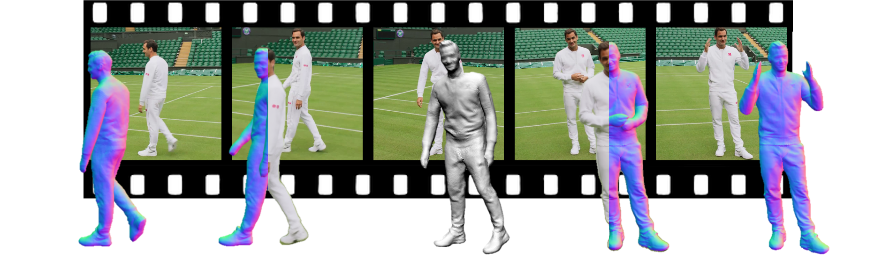

# Vid2Avatar: 3D Avatar Reconstruction from Videos in the Wild via Self-supervised Scene Decomposition
## [Paper](https://arxiv.org/abs/2302.11566) | [Video Youtube](https://youtu.be/EGi47YeIeGQ) | [Project Page](https://moygcc.github.io/vid2avatar/) | [SynWild Data](https://synwild.ait.ethz.ch/)


Official Repository for CVPR 2023 paper [*Vid2Avatar: 3D Avatar Reconstruction from Videos in the Wild via Self-supervised Scene Decomposition*](https://arxiv.org/abs/2302.11566). 

 

## Getting Started
* Clone this repo: `git clone https://github.com/MoyGcc/vid2avatar`
* Create a python virtual environment and activate. `conda create -n v2a python=3.7` and `conda activate v2a`
* Install dependenices. `cd vid2avatar`, `pip install -r requirement.txt` and `cd code; python setup.py develop`
* Install [Kaolin](https://kaolin.readthedocs.io/en/v0.10.0/notes/installation.html). We use version 0.10.0.
* Download [SMPL model](https://smpl.is.tue.mpg.de/download.php) (1.0.0 for Python 2.7 (10 shape PCs)) and move them to the corresponding places:
```
mkdir code/lib/smpl/smpl_model/
mv /path/to/smpl/models/basicModel_f_lbs_10_207_0_v1.0.0.pkl code/lib/smpl/smpl_model/SMPL_FEMALE.pkl
mv /path/to/smpl/models/basicmodel_m_lbs_10_207_0_v1.0.0.pkl code/lib/smpl/smpl_model/SMPL_MALE.pkl
```
## Download preprocessed demo data
You can quickly start trying out Vid2Avatar with a preprocessed demo sequence including the pre-trained checkpoint. This can be downloaded from [Google drive](https://drive.google.com/drive/u/1/folders/1AUtKSmib7CvpWBCFO6mQ9spVrga_CTU4) which is originally a video clip provided by [NeuMan](https://github.com/apple/ml-neuman). Put this preprocessed demo data under the folder `data/` and put the folder `checkpoints` under `outputs/parkinglot/`.

## Training
Before training, make sure that the `metaninfo` in the data config file `/code/confs/dataset/video.yaml` does match the expected training video. You can also continue the training by changing the flag `is_continue` in the model config file `code/confs/model/model_w_bg`. And then run:
```
cd code
python train.py
```
The training usually takes 24-48 hours. The validation results can be found at `outputs/`.
## Test
Run the following command to obtain the final outputs. By default, this loads the latest checkpoint.
```
cd code
python test.py
```
## 3D Visualization
We use [AITViewer](https://github.com/eth-ait/aitviewer) to visualize the human models in 3D. First install AITViewer: `pip install aitviewer imgui==1.4.1`, and then run the following command to visualize the canonical mesh (--mode static) or deformed mesh sequence (--mode dynamic):
```
cd visualization 
python vis.py --mode {MODE} --path {PATH}
```
<p align="center">
   
</p>

## Play on custom video
* We use [ROMP](https://github.com/Arthur151/ROMP#installation) to obtain initial SMPL shape and poses: `pip install --upgrade simple-romp`
* Install [OpenPose](https://github.com/CMU-Perceptual-Computing-Lab/openpose/blob/master/doc/installation/0_index.md) as well as the python bindings.
* Put the video frames under the folder `preprocessing/raw_data/{SEQUENCE_NAME}/frames`
* Modify the preprocessing script `preprocessing/run_preprocessing.sh` accordingly: the data source, sequence name, and the gender. The data source is by default "custom" which will estimate camera intrinsics. If the camera intrinsics are known, it's better if the true camera parameters can be given.
* Run preprocessing: `cd preprocessing` and `bash run_preprocessing.sh`. The processed data will be stored in `data/`. The intermediate outputs of the preprocessing can be found at `preprocessing/raw_data/{SEQUENCE_NAME}/`
* Launch training and test in the same way as above. The `metainfo` in the data config file `/code/confs/dataset/video.yaml` should be changed according to the custom video.

<p align="center">
     
</p>

## Acknowledgement
We have used codes from other great research work, including [VolSDF](https://github.com/lioryariv/volsdf), [NeRF++](https://github.com/Kai-46/nerfplusplus), [SMPL-X](https://github.com/vchoutas/smplx), [Anim-NeRF](https://github.com/JanaldoChen/Anim-NeRF), [I M Avatar](https://github.com/zhengyuf/IMavatar) and [SNARF](https://github.com/xuchen-ethz/snarf). We sincerely thank the authors for their awesome work! We also thank the authors of [ICON](https://github.com/YuliangXiu/ICON) and [SelfRecon](https://github.com/jby1993/SelfReconCode) for discussing experiment.

## Related Works 
Here are more recent related human body reconstruction projects from our team:
* [Jiang and Chen et. al. - InstantAvatar: Learning Avatars from Monocular Video in 60 Seconds](https://github.com/tijiang13/InstantAvatar)
* [Shen and Guo et. al. - X-Avatar: Expressive Human Avatars](https://skype-line.github.io/projects/X-Avatar/)
* [Yin et. al. - Hi4D: 4D Instance Segmentation of Close Human Interaction](https://yifeiyin04.github.io/Hi4D/)

```
@inproceedings{guo2023vid2avatar,
      title={Vid2Avatar: 3D Avatar Reconstruction from Videos in the Wild via Self-supervised Scene Decomposition},
      author={Guo, Chen and Jiang, Tianjian and Chen, Xu and Song, Jie and Hilliges, Otmar},    
      booktitle = {Computer Vision and Pattern Recognition (CVPR)},
      year      = {2023}
    }
```
